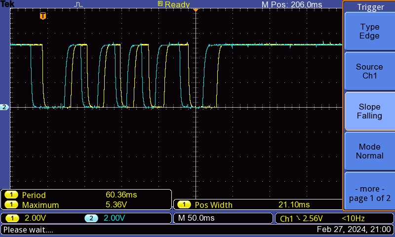
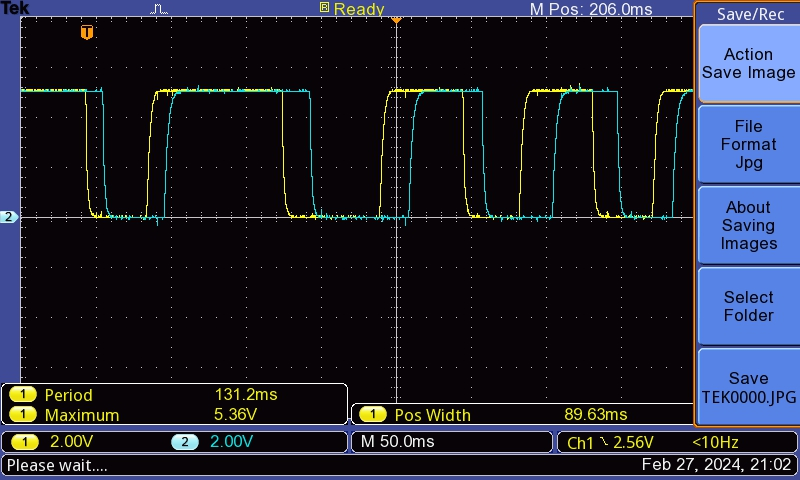

Rotační enkoder je digitální zařízení umožňující generovat pulzy při svém pohybu (rotaci). Využívá dva signály, zpravidla označené A a B. Na enkoderu pro Arduino jsou tyto signály obvykle označeny DT (data) a CLK (hodinový signál). Při rotaci se generuje tzv. kvadraturní signál. Dva signály jsou vůči sobě vzájemně posunuty o čtvrt periody (při konstantní rychlosti otáčení).

Signály `DT` i `CLK` jsou zapojeny s pull-up rezistorem. Program primárně detekuje změnu signálu `DT` podmínkou `DT != _DT`, kde `_DT` uchovává předchozí hodnotu `DT`. Pokud je změna detekována, dojde ke kontrole, zda se jedná o náběžnou hranu (tj. `DT` je aktuálně `HIGH`), nebo zda se jedná o sestupnou hranu (tj. `DT` je atkuálně `LOW`). Při náběžné i sestupné hraně `DT` se pak kontroluje směr, který udává, zda se `pozice` bude přičítat či odčítat.

Při pohybu ve směru hodinových ručiček přichází nejdříve náběžná hrana na mnodrém signálu, kdežto při pohybu proti směru ručiček je první náběžná hrana žlutého signálu. Tímto lze snadno detekovat směr otáčení.

`DT` je žlutý
`CLK` modrý