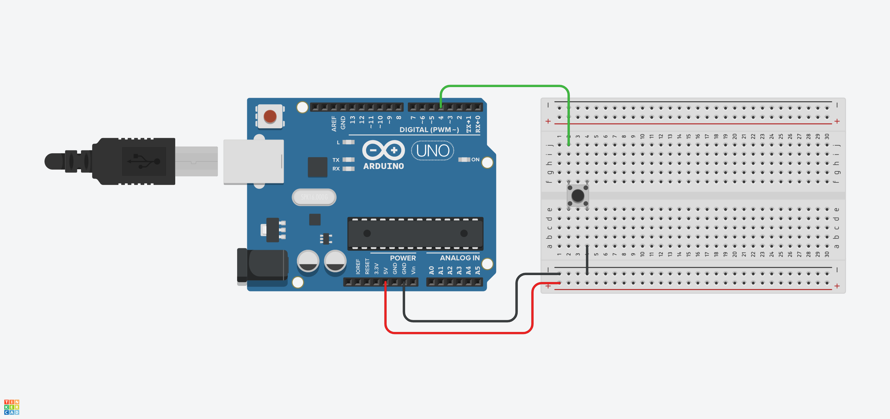

# Tlačítko s debounce funkcí

Funkce debounce obecně slouží jako prevence proti záchěvům při stisku tlačítka. Měla by zamezit opakované detekci stisku tlačítka při náhodném opětovném stisknutí nebo při nedokonalém elektrickém kontaktu.

Při každém stisku tlačítka je uložen čas `cas_posledniho_stisknuti = millis();`, kdy byl stisk detekován.

Proměnná `cas_posledniho_stisknuti` je statická, což znamená, že její hodnota je uchována mezi každým voláním funkce, v níž je deklarována. Pokud by tak nebylo, tato proměnná by byla při každém volání funkce nulová, a nebylo by možné odměřovat čas mezi jednotlivými stisknutími.

Podmínkou `if (millis() - cas_posledniho_stisknuti >= DEBOUNCE_TIME)` je kontrolována doba mezi jednotlivými stisknutími tlačítka. Pokud je podmínka splněna, tj. uběhl čas `DEBOUNCE_TIME` v milisekundách, je nastavena návratová hodnota `stisknuto` na logickou jedničku. V opačném případě funkce `byte tlacitko_stisknuto()` vrací logickou 0.
